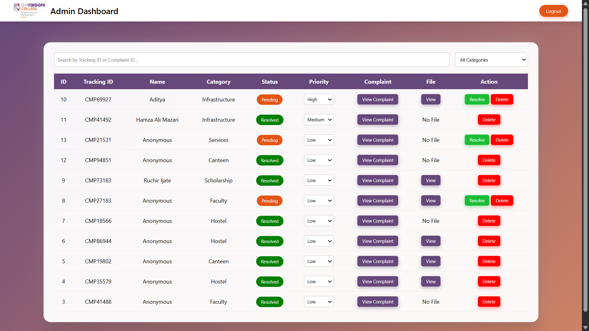
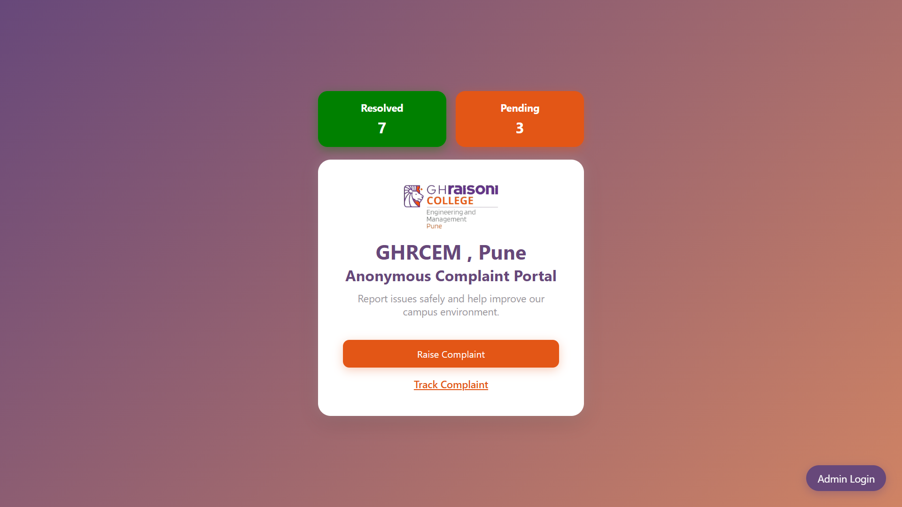
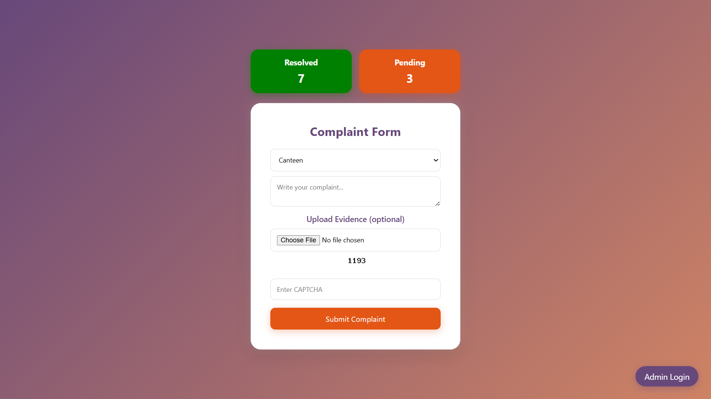
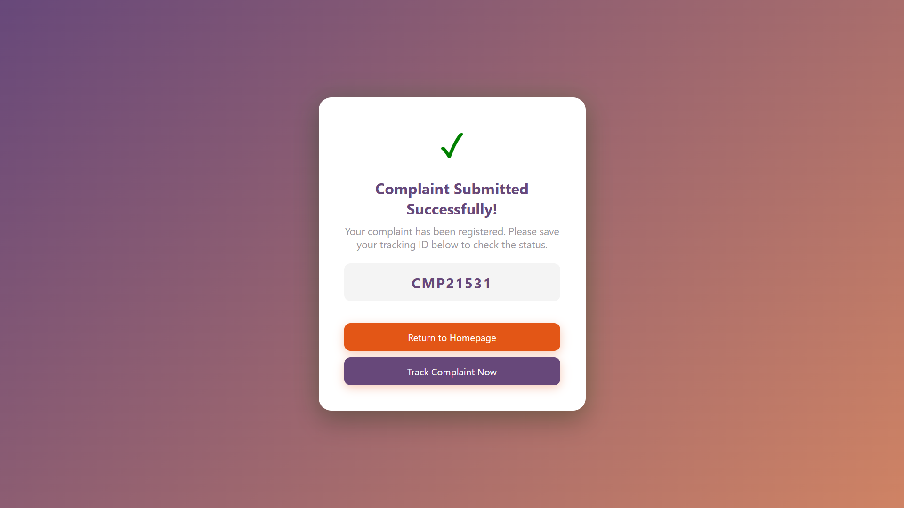
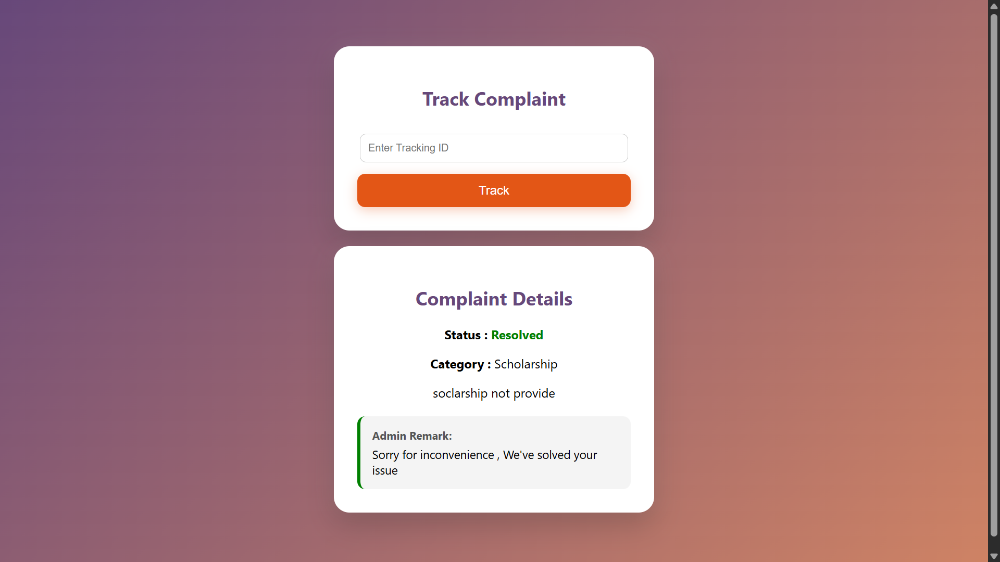

# 🛡️ Anonymous Complaint Portal

A **secure web-based platform** that allows users to submit complaints anonymously and track their status using a unique tracking ID.

## 🚀 **Features**
- 🕵️ Anonymous Complaint Submission
- 🆔 Unique Tracking ID Generation
- 🔍 Complaint Status Tracking (No Login Required)
- 📊 Admin Dashboard for Complaint Management
- ✅ Status Update (Pending / Resolved)
- 📂 File Upload Support (Evidence)
- 🔐 CAPTCHA Verification for Security
- 🔎 Search and Filter Functionality

## 🧠 **Project Objective**
The main objective of this project is to provide a secure platform where users can report issues without fear of identity exposure. It helps improve transparency and ensures that complaints are properly handled.

## ⚙️ **Technologies Used**
- HTML
- CSS
- JavaScript
- PHP
- MySQL
- XAMPP Server

## 📁 Project Structure
    ├── index.php
    ├── submit_complaint.php
    ├── track.php
    ├── admin_dashboard.php
    ├── db.php
    ├── style.css
    ├── script.js
    ├── uploads/

## 🔄 Working Flow
- User submits complaint
- Tracking ID generated
- Data stored in database
- Admin manages complaints
- User tracks complaint

## 🔐 Security Features
- Input sanitization
- CAPTCHA verification
- Session-based admin login

## 🚀 Future Scope
- Email notifications
- Mobile application
- Advanced security
- AI-based complaint analysis

## 📸 Screenshots

### 🧑‍💼 Admin Dashboard

---

### 🏠 Homepage

---

### 📝 Complaint Form

---

### ✅ Complaint Submitted

---

### 🔍 Tracking Page

## 📌 Conclusion
This project provides a secure, efficient, and anonymous platform for complaint management.
